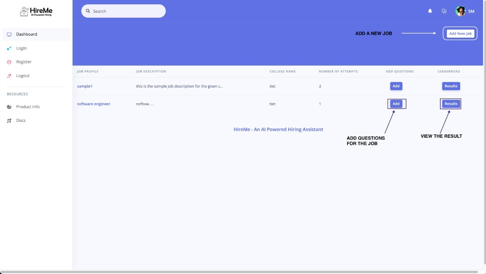
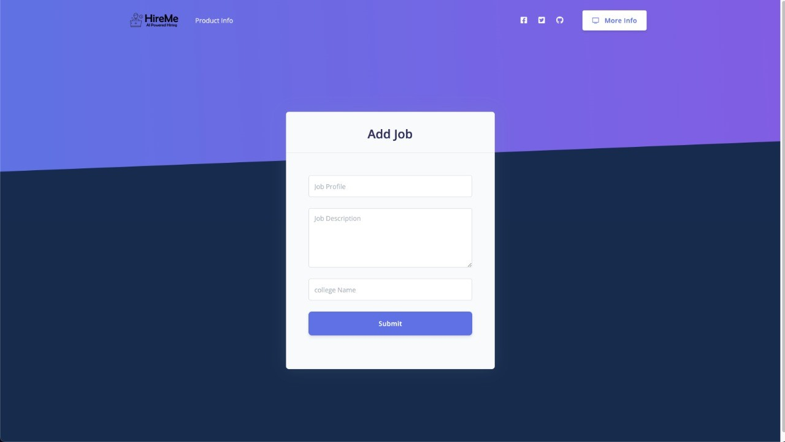
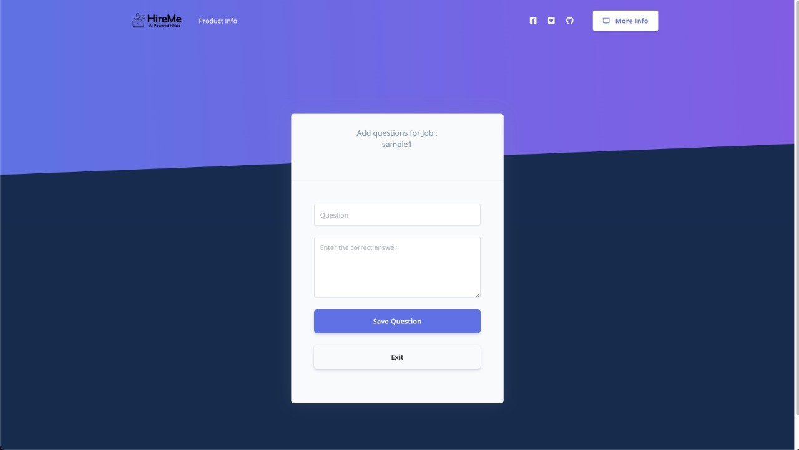
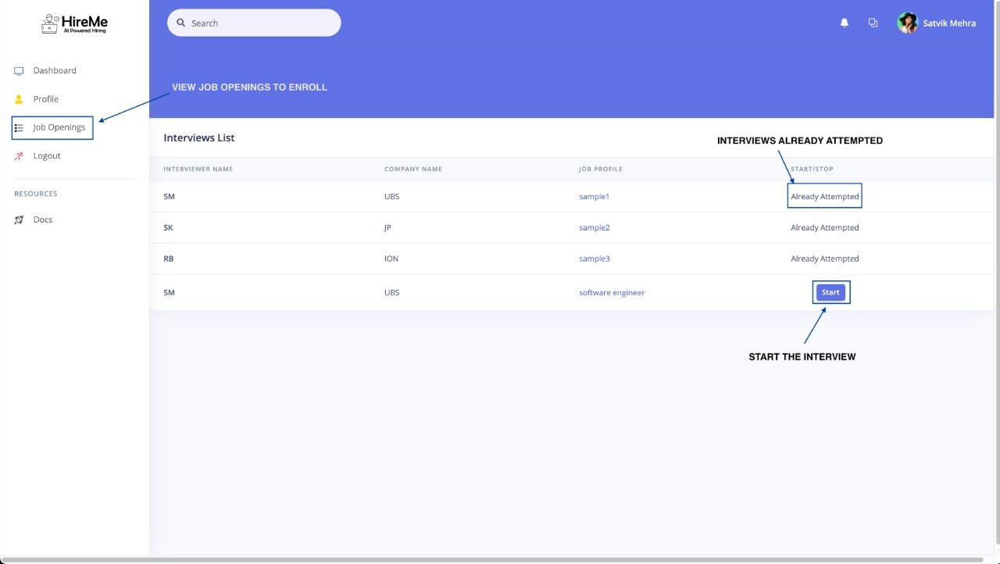
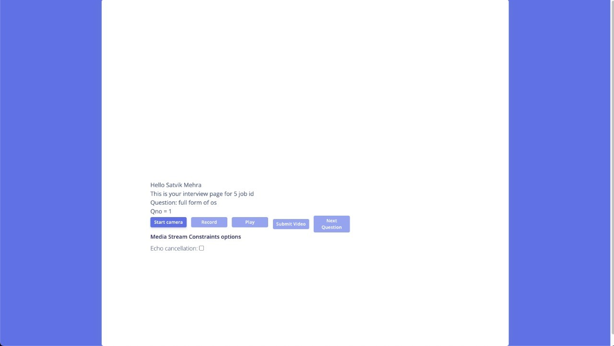
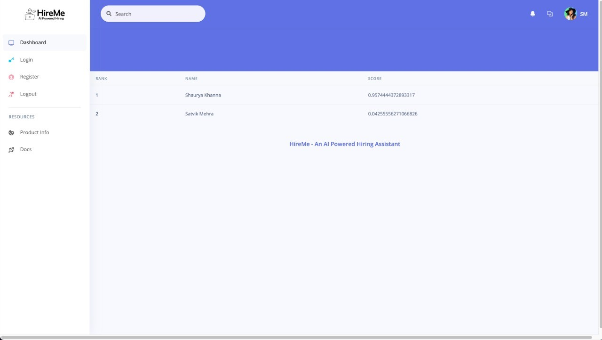

[Logo](static/assets/img/brand/HireMe1.png)
# HireMe
## _AI Powered Hiring Assistant_

## Screenshots

## Features

- Take auto proctored assessments and interviews to ensure authenticity and integrity of the online  recruitment process.
-  Optimize the recruitment process by making it bias free by standardizing the process across all geographies and interviewers.
- Apply audio tone analysis and emotion analysis to evaluate the candidate and generate the result along with rank list.
- Save all the data generated and send it to companies and campuses, so that colleges can which part of their curriculum needs more attention.

## 🛠Tech

- Python
- Flask
- SQL
- Machine Learning
    - Video Emotion Analysis
    - Audio Tone Analysis
    - Text Similarity 

## Authors

- [Shaurya Khanna](https://www.linkedin.com/in/shaurya-2703/)
- [Satvik Mehra](https://www.github.com/satvik1403)
- [Rohit Bhatia](https://www.github.com/rb_01)
- [Parivansh Deep Singh](https://www.github.com/rb_01)
